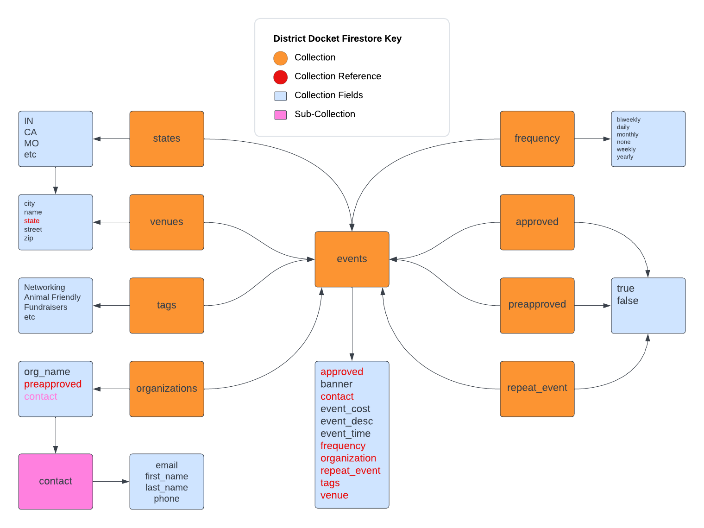
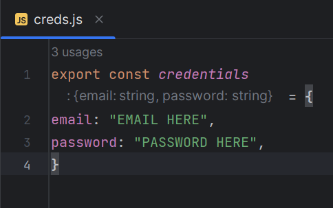
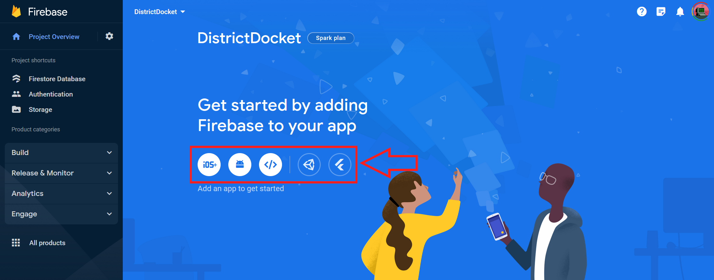
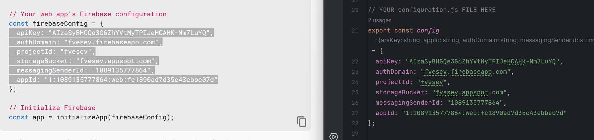

# District Docket

District Docket is a simple calendar management system that aims to unify the event calendars of many organizations across Dekalb County through the Dekalb County Chamber of Commerce website. Below you will find documentation regarding each of the apps core functionalities and everything you will need to get started.

## Firebase Configuration

To use District Docket, it is important to note that a Firebase project is required as all code was created to function within Firestore. To set up your Firebase instance, please follow the instructions below.

### Creating a Firebase Project

1. Login or create a Google account (a Google account is required to use Firebase).
2. Click "Get Started" at the following [Link](https://firebase.google.com/).
3. Click on the button labeled "Add a Project" and follow the initial setup. For this there will be three steps.
   1. Choose your project name.
   2. Enable or disable Google Analytics for your project.
   3. Choose Google Analytics account to use (this is only applicable if enabled in the previous step).
   4. Click "Create Project".

### <h3 id="firestore-database-schema">Firestore Database Schema</h3>

<br>

### Firebase Storage Setup

Firebase Storage is used in District Docket to store banner images that are stored for events. Setting up Firebase Storage is very simple.

1. From the left menu in Firebase, click "All Products" then select "Storage".
2. Click "Get Started" and choose production mode when prompted.
3. If prompted choose your server your data will be stored on and click enable.
4. From here, go to the rules tab and make sure your code looks something like this to ensure images load on your calendar. You can add more rules here to increase security of your storage bucket, but this is the bare minimum to get up and running.

```
rules_version = '2';
   service firebase.storage {
      match /b/{bucket}/o {
         match /{allPaths=**} {
      allow read, write: if request.auth != null;
      }
   }
}
```

### Firestore Database Setup

Setting up your Firestore database is very simple with the files included in the District Docket codebase. Below are the steps to create your database. Please note that running the setup files will create a sample entry in your database. This is done as Firestore needs an entry in the database as it will not create the table otherwise. To see the current layout of the Firestore database, see <a href="#firestore-database-schema">Firestore Database Schema</a>

1. Setup your creds.js file using the login information you setup. Please refer to <a href="#config-file">Firebase Authentication Setup</a> on how to get this information.
2. Add information to configuration.js file located at js/backend/connection/configuration.js. See <a href="#config-file">Configuring configuration.js File</a> on how to do this.
3. From here, go to the rules tab and make sure your code looks something like this to ensure you can read and write to the database. You can add more rules here to increase security of your database, but this is the bare minimum to get up and running.

```
rules_version = '2';
service cloud.firestore {
  match /databases/{database}/documents {
    match /{document=**} {
      allow read, write: if request.auth != null;
    }
  }
}
```

4. Open the setup file and run the setup.html file. Assuming your credentials and configuration file have been setup properly, this will create a sample entry in Firestore.

### <h3 id="firebase-auth-setup">Firebase Authentication Setup</h3>

Authentication on your Firebase project is very important as this is how you will eventually connect to your Firebase project. Below you will find steps showing how to set up accounts with Firebase Authentication

1. From the left menu in Firebase, click "All Products" then select "Authentication".
2. Choose "Email/Password" as your provider. For this do not enable passwordless sign-on, but make sure to enable to checkbox for "Email/Password".
3. Afterwards click the "Users" tab and create the account credentials that will be used to gather data onto the site.
4. Finally, we need to take the authentication information and add it to the blank creds.js file located at js/backend/connection/creds.js. See below for layout of creds.js file.
   <br><br>

### <h3 id="config-file">Configuring configuration.js File</h3>

Configuring the configuration.js file is essential for setting up your Firestore instance with the District Docket codebase as this is how authentication will be handled with accounts. Follow the instructions below to set this up.

1. From the home page in your Firebase instance, click the button that looks like  to add an app. See image below for where to go to find this.
   <br><br>
   Please note sometimes Firebase will hide the individual icons shown above in place of a single "Add App" button. If this happens, please click "Add App" then click the  icon.
2. Name your app and click "Register App".
3. On the next page you will see some code. Copy and paste the values inside the array into the configuration.js file. See image below for how to do this.
   <br>
4. Click "Continue to Console".
